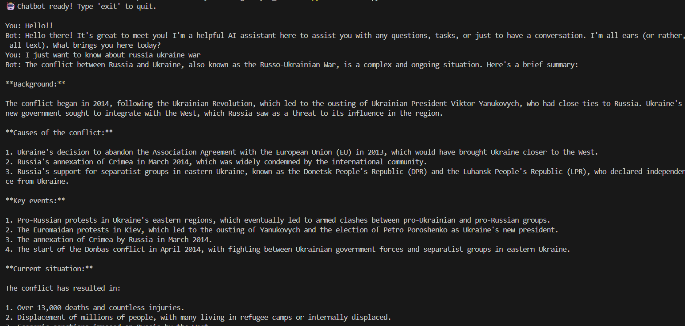
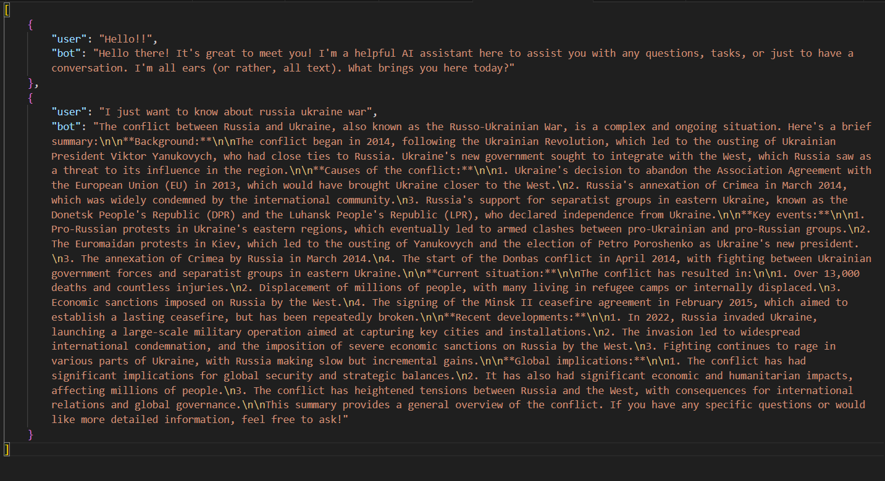

# 🤖 Day 1: Simple Chatbot – NEO AI  

NEO AI is a **beginner-friendly chatbot** powered by **HuggingFace (`flan-t5-large`)** and **Groq (`llama-3-8b`)**.  
It uses HuggingFace as the **primary API**, and if HuggingFace fails (e.g., due to rate limit or downtime), it **automatically falls back** to Groq for reliable responses.  

This project is part of a **100 Days of AI Coding Challenge**, starting with the basics of conversational AI.  

---

## 📂 Project Structure

```
day1_chatbot/
├── chatbot.py # Main Python script
├── requirements.txt # Required dependencies
├── .env # Environment variables (API keys)
└── README.md # Project documentation
```
---

## ⚙️ Features
- ✅ AI chatbot using HuggingFace (`flan-t5-large`)  
- ✅ Fallback to Groq API (`llama-3-8b`)  
- ✅ Simple command-line interface  
- ✅ Easy to set up and run  
- ✅ Beginner-friendly structure  

---

## 🔑 Environment Variables  

Create a **.env** file inside `day1_chatbot/` and add your keys:  

```env
HUGGINGFACE_API_KEY=your_huggingface_api_key_here
GROQ_API_KEY=your_groq_api_key_here
```

## 👉 Get your keys here:

HuggingFace: https://huggingface.co/settings/tokens

Groq: https://console.groq.com/keys
 

---

## 📦 Requirements

Install the dependencies before running the chatbot:

```
pip install -r requirements.txt
```

requirements.txt includes:

```
requests
python-dotenv
```

---

## 🚀 How to Run

1. Clone this repository
```
git clone https://github.com/your-username/neo-ai-chatbot.git
cd neo-ai-chatbot/day1_chatbot
```
2. Add your API keys to .env file
3. Run the chatbot
4. python chatbot.py
5. Start chatting with NEO AI 🤖

---

## 🖼️ Demo Screenshots

### 🔹 Chatbot in Action  

  

### 🔹 Chat history




---

## 🙌 Acknowledgements

- [HuggingFace Inference API](https://huggingface.co/inference-api) – for providing free and powerful AI models.  
- [Groq Cloud API](https://groq.com/) – for blazing fast inference and serving as fallback API.  

---

## 🤝 Contributing

Pull requests are welcome! If you have a better model suggestion or improvements, feel free to open an issue or PR.

---


## 📜 License

This project is licensed under the MIT License.
